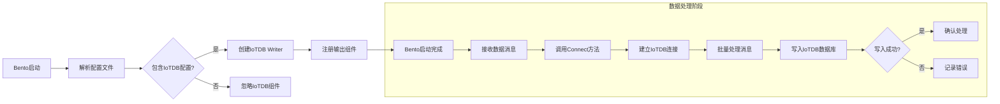
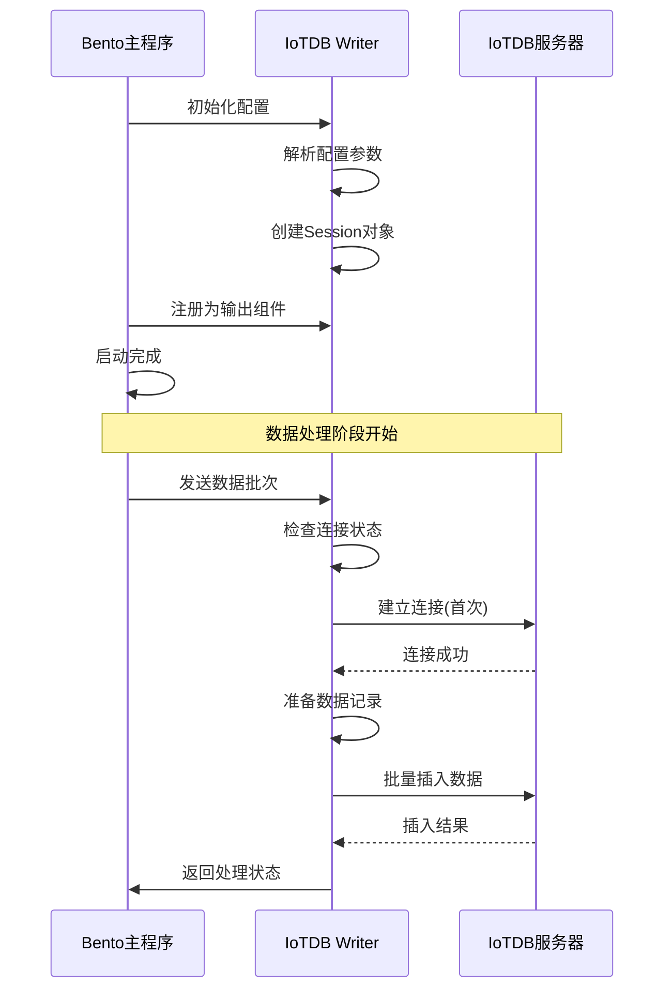

# Bento 启动 IoTDB Sink 的业务流程

## 启动流程图

## 组件初始化流程

## 关键步骤说明

### 1. 配置解析阶段
- Bento 启动时读取 YAML 配置文件
- 检测是否存在 `iotdb` 输出配置块
- 解析配置参数：地址、用户名、密码、数据库名、超时等

### 2. 组件初始化阶段
- 创建 `iotdbWriter` 结构体实例
- 初始化 IoTDB 客户端 Session
- 注册为 Bento 输出组件

### 3. 连接建立阶段
- 首次接收到数据时调用 `Connect` 方法
- 使用配置信息建立与 IoTDB 的连接
- 保持长连接以提高性能

### 4. 数据处理阶段
- 接收来自上游的数据消息
- 根据批处理配置积累消息
- 将消息转换为 IoTDB 记录格式
- 调用 IoTDB 客户端 API 插入数据
- 返回处理结果给 Bento 核心引擎

这个流程确保了 Bento 能够稳定、高效地将数据写入 IoTDB 时间序列数据库。