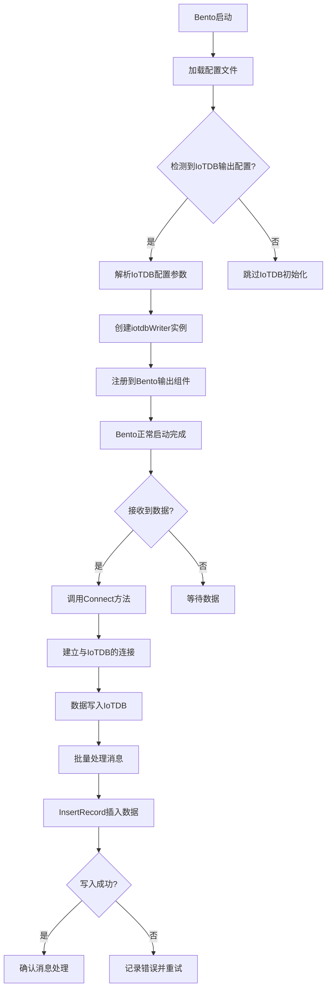

## 详细说明

1. **启动阶段**:
   - Bento 启动时加载用户提供的配置文件
   - 检测是否存在 IoTDB 输出配置
   - 如果存在，则解析相关参数并创建 iotdbWriter 实例
   - 将实例注册到 Bento 的输出组件系统中

2. **连接阶段**:
   - 当第一条数据到达时，调用 Connect 方法
   - 使用配置的地址、用户名、密码等信息建立与 IoTDB 的连接
   - 连接成功后，保持连接以供后续数据写入

3. **数据处理阶段**:
   - 接收到来自上游的数据消息
   - 根据配置的批处理策略积累消息
   - 将消息批量写入 IoTDB
   - 每条消息被转换为 IoTDB 记录并插入数据库

4. **错误处理**:
   - 如果写入过程中出现错误，记录日志并根据需要进行重试
   - 成功写入的消息会被确认处理
   - 失败的消息可能会触发重连或其他恢复机制